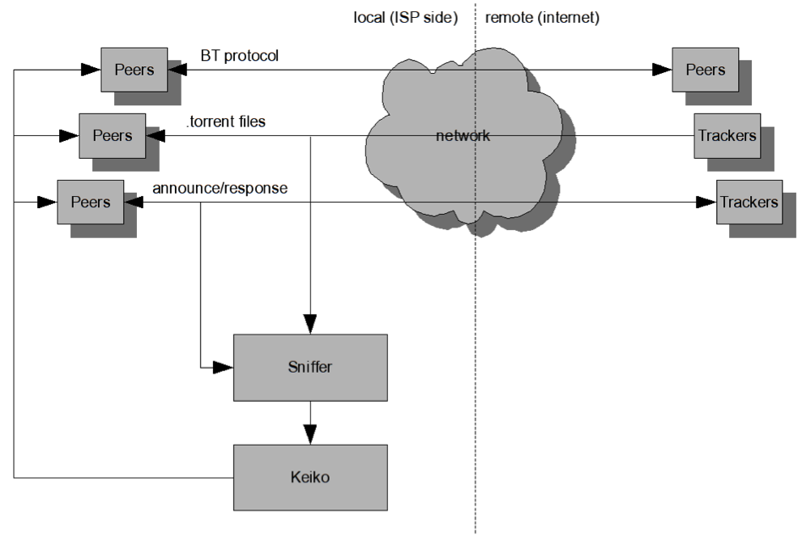
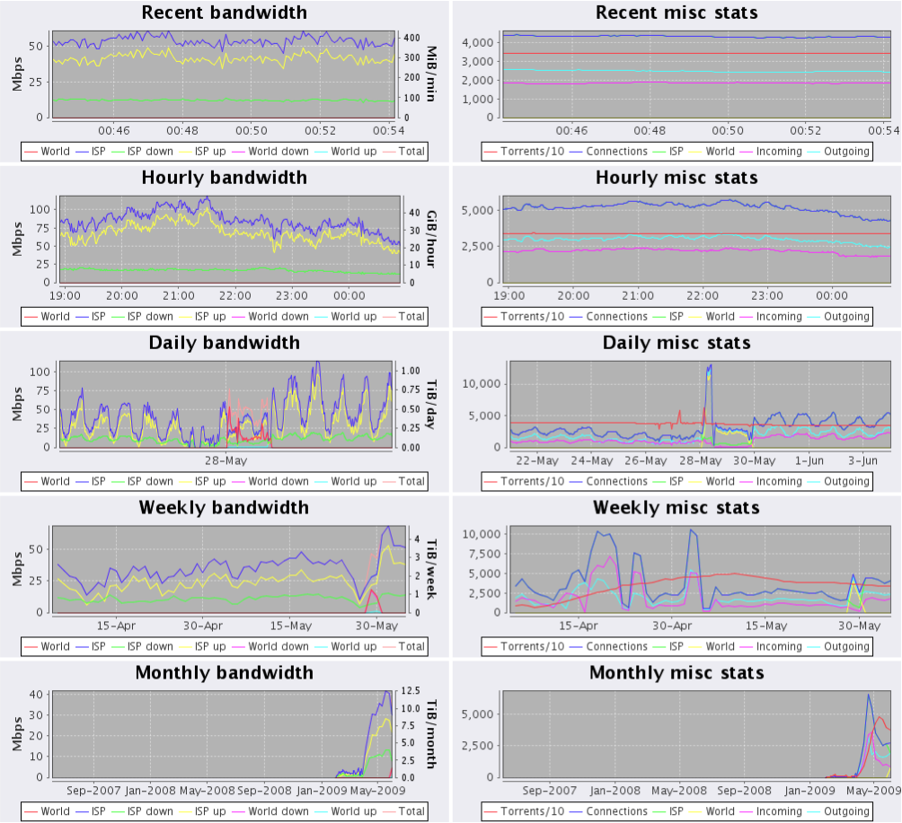
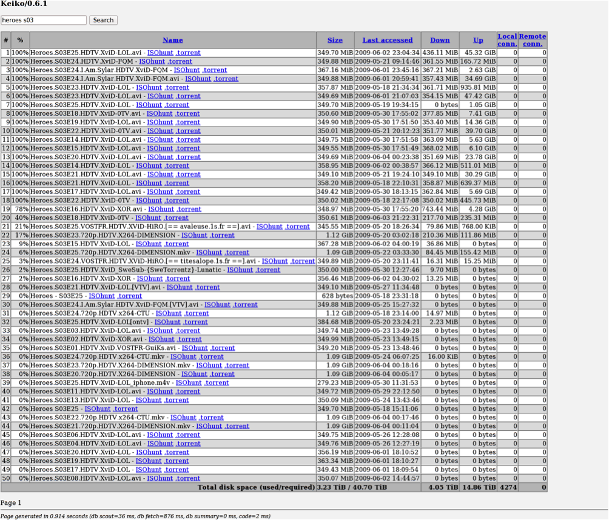

# Keiko Torrent Cacher

Back in 2008/2009 we developed a Torrent Caching System with the purpose to have a product that would reduce the cost of ISP bandwidth by caching torrents. We even trialed the product with one small ISP and it worked very well with good user feedback. But as it usually happens bandwidth prices have dropped significantly and there was no economic reason to have a server farm when bandwidth was much cheaper.

Project was forgoten. Now we found a backup copy which is not complete and are putting it on GitHub. Maybe someone will find it interesting.

Disclaimer: we do not provide support for the product as original developer is not working any more. We recovered old and outdated README file below. 

##
## ==== ORIGINAL README ====
##

#Keiko - BitTorrent Caching System

Users and administration Guide v0.2

**26. October 2009.**

**\
\
 http://www.instantcom.net\
\
**

Introduction
============

P2P (peer-to-peer) traffic is growing year after year. Every ISP knows
P2P traffic is major part of overall traffic and out of all P2P traffic,
BT (Bit Torrent) protocol is the most common. In order to help decrease
ISP's costs, Keiko was designed, a Bit Torrent caching system written
entirely in Java.

Keiko works in cluster environment to accommodate different ISP size
needs.

Features
========

### Scalability

There is no limit on number of nodes in caching cluster. You can use as
many nodes as you want. Each node is responsible for its own torrents.

### Automatic self-tuning based on ever-changing behaviours of peers

With cron job properly set up, behaviour of peers is monitored and
configuration appropriately changed.

### Half-transparent caching

Existing traffic is not disrupted in any way. Peers see Keiko as just
another torrent client.

Architecture
============

Keiko caching system is made of the following components:

### Keiko-sniffer

Monitors announces to trackers and downloads of .torrent files and sends
them to Keiko (cacher).

### Keiko

Works with peers downloading from and uploading to them, caching pieces
in between.

Each component (Sniffer or Keiko) can be clustered
and dimensioned for different loads.

Keiko-Sniffer (sniffer)
=======================

Entire traffic from users is mirrored to one or more sniffers. Since
monitoring entire traffic would require infinitely fast machine, sniffer
filters out all traffic that is not directed from/to predefined BT
trackers. Tracker announces and .torrent files are sent to Keiko
providing it with new torrents and steady supply of peers.

Sniffer's cron job periodically listens to entire traffic in order to
determine which BT trackers are most frequently used. It then updates
sniffer's configuration and restarts sniffer. This way system is
automatically tuned based on behaviour of peers.

Mirroring of traffic can be done on Cisco Routers.

Keiko (cacher)
==============

Keiko is getting new torrents from sniffer together with steady supply
of peers. It establishes connections to these peers downloading and
uploading from/to them. Cached pieces are saved to one or more disks for
future use. When disk(s) get full, eldest torrents get deleted freeing
space for new ones.

Putting it all together
=======================

There isn't just one way to form the cluster. In fact, cluster can be
formed many ways: single sniffer with single cacher, N sniffers with
single cacher, single sniffer with N cachers or N sniffers with N
cachers. Note however that due to extensive use of resources placing
sniffer and Keiko on the same physical machine is not recommended.

Installation and Configuration
==============================

Following procedure is based on installation on a Debian OS.

Keiko-sniffer
=============

1.  Download and install latest Java SE JDK from:

> http://java.sun.com/

1.  Download and install latest JPCAP from:

> http://netresearch.ics.uci.edu/kfujii/jpcap/doc/download.html

1.  Install ngrep package:

> \$ sudo apt-get install ngrep

1.  Create user account for sniffer:

> \$ sudo adduser torrent

1.  Unpack keiko-sniffer:

> \$ sudo tar xzvPf Keiko-sniffer-linux86\_64-0.3.2.tar.gz

1.  Recursively change ownership of sniffer's directory:

> \$ sudo chown -R torrent.torrent /opt/keiko-sniffer

1.  Edit /opt/keiko-sniffer/conf/keiko-sniffer.conf

> Change “interface” to interface mirrored traffic is coming to:
>
> interface=bond0
>
> Change “keiko.host” to IP or hostname of Keiko (cacher). You need only
> one sniffer-to-cacher connection per sniffer, once Keiko gets data
> from sniffer it will broadcast it (when needed) to all nodes in the
> cluster.

1.  Edit /opt/keiko-sniffer/conf/wrapper.conf

> Change “wrapper.java.command” to absolute path of Java executable
>
> (for instance, /opt/jdk1.6.0\_13/bin/Java ).
>
> Change “wrapper.java.maxmemory” to number of megabytes JVM will be
> allowed to use. Actual value may vary based on amount of traffic
> mirrored (more the better). Note, “wrapper.java.maxmemory” doesn't
> work correctly for values over 4096. If you plan to use such large
> amount, comment “wrapper.java.maxmemory” and use
> “wrapper.java.additional.N=-Xmx6144m” instead.

1.  Add torrent user to sudoers:

> \$ visudo
>
> Add the following line at the end:
>
> torrent ALL = NOPASSWD: /usr/bin/ngrep,
> /opt/keiko-sniffer/init/keiko-sniffer

1.  Create cron jobs for torrent user:

> \$ sudo crontab -u torrent -e
>
> Add the following lines:
>
> 6 0 \* \* \* /opt/keiko-sniffer/init/manage-log-files 1\>/dev/null
> 2\>/dev/null
>
> 0 12 8,18,28 \* \* /opt/keiko-sniffer/init/analyze.sh 1\>/dev/null
> 2\>/dev/null

1.  Proceed with configuration of Keiko (cacher) or start sniffer if you
    did that already:

> \$ sudo /opt/keiko-sniffer/init/keiko-sniffer start
>
> Note: sniffer must always be started as root.

Keiko
=====

1.  Download and install latest Java SE JDK from:

> http://java.sun.com/

1.  Create user account for Keiko:

> \$ sudo adduser torrent

1.  Unpack Keiko:

> \$ sudo tar xzvPf keiko-linux86\_64-0.6.1.tar.gz

1.  Recursively change ownership of keiko's directory:

> \$ sudo chown -R torrent.torrent /opt/keiko

1.  Edit /opt/keiko/conf/wrapper.conf ...

> Change “wrapper.java.command” to absolute path of Java executable
>
> (for instance, /opt/jdk1.6.0\_13/bin/Java).
>
> Change “wrapper.java.additional.5” (or wherever -Xmx parameter is) to
> number of megabytes JVM will be allowed to use. Actual value may vary
> based on how you configure keiko.conf later.

1.  Edit /opt/keiko/conf/keiko.conf based on instructions there. Each
    option is documented.

> IMPORTANT: every Keiko (cacher) node in cluster must have unique
> “my.server.id”.
>
> If you plan to use more than one Keiko (cacher) node in the cluster
> you'll probably want to enable multicasting (see
> http://www.jgroups.org/ for details).
>
> If you use only one Keiko (cacher) you can add the following line to
> keiko.conf:
>
> cluster=false
>
> Only one web server is needed in cluster. Use “use.web.server=true”
> only on single node, set “use.web.server=false” on others.

1.  Configure disks for Keiko:

> \$ sudo touch /cache1/keiko-cache
>
> \$ sudo chown -R torrent.torrent /cache1
>
> This will ensure Keiko recognizes /cache1 as dedicated disk for cache.
> Repeat for all disks you plan to use.
>
> Any file system supporting sparse files will do (for instance, ext3 is
> a good choice).

1.  Edit /opt/keiko/conf/hibernate.properties and configure it for
    database you'll be using. Keiko must have privileges to create and
    drop tables belonging to the database.

> Set “hibernate.hbm2ddl.auto” to “create” first time you start Keiko,
> this will ensure all necessary tables get created. It's recommended to
> set it back to “none” or “update” after first start.

1.  Edit /opt/keiko/conf/webauth.properties and change admin's password.
    For instance, if admin password is “foobar”:

> admin: foobar, admin

1.  Create cron job for torrent user:

> \$ sudo crontab -u torrent -e
>
> Add the following line:
>
> 15 0 \* \* \* /opt/keiko/init/manage-log-files 1\>/dev/null
> 2\>/dev/null

1.  If you disabled access to remote peers in step 6 (default is
    disabled), skip to next step.

> If you want to use a block list, than put it to keiko's lib/
> subdirectory:
>
> \$ cp filter.dat.gz /opt/keiko/lib/
>
> Don't unpack (gunzip) this file, leave it in its original form.

1.  Proceed to firewall configuration or if you already done that then
    log in as torrent user and start Keiko:

> \$ /opt/keiko/init/keiko start
>
> Note: don't ever start Keiko as root!

Firewall
========

This section applies only for Keiko (cacher) nodes.

For every IP range (x.x.x.x – y.y.y.y) which belongs to ISP and port
range (ppppp – ttttt, see “my.torrent.ip” you configured in keiko.conf)
add the following line:

iptables -A input -p tcp --dport ppppp:ttttt -m iprange --src-range
x.x.x.x-y.y.y.y -j ACCEPT

Note, you don't want to allow incoming connections from the internet
(non-ISP IPs). Due to huge number of torrents hosted it would generate
way too many connections.

For every sniffer IP which will connect to this Keiko (cacher) node add
the following:

iptables -A input -p tcp -s x.x.x.x --dport 7777 -j ACCEPT

Only for node which hosts web server for whole cluster add the following
line:

iptables -A input -p tcp –dport 8080 -m iprange –src-range
x.x.x.x-y.y.y.y -j ACCEPT

(x.x.x.x – y.y.y.y is the range you will connect from, such as VPN).

Web
===

You can access statistics at the node you configured as web server. For
instance, if web server node has hostname “web” then you access it with:

http://web:8080/keiko/stats (graphs)

http://web:8080/keiko/browse (torrents)

You'll need to log in to both pages using the information you configured
in step 9 of section 4.2.

Stats
=====

On the stats page you can view graphs of bandwidth usage as well as
number of connections and torrents.

Browse
======

On the browse page you can view and search all cached torrents, sort
them by completion percentage, name, size, last accessed time, traffic
or peers. Note that displayed torrents are not updated in real-time as
each instance of Keiko updates torrents once every 10 minutes.

Logging
=======

Both sniffer and keiko use log4j for logging. You can find logs for each
application in its log/ subdirectory. You can configure logging for each
application separately in its own config file. Note however that debug
level for root logger is not recommended as it will generate extremely
high quantities of logging messages potentially filling entire free disk
space.

Frequently asked questions (FAQ)
================================

**Q: How successful is caching?**

A: There is really no universal answer. Successfulness of this system
depends on many factors such as number of users/peers, their unused
download/upload bandwidth, number of peers they're already connected to,
limits on upload/download enforced by users and all the other factors
that can't be influenced.

**Q: Are there any guarantees this system will work for ISP such as
ours?**

A: Unfortunately, due to overwhelming number of factors in P2P network
such as BT no guarantees can be made.

**Q: How do other peers see Keiko?**

A: They see it as µTorrent 1.8.2, latest stable version of the most
common BT client today.

**Q: Is Keiko based on µTorrent?**

A: No, Keiko was written from scratch in Java with thousands of torrents
at the same time in mind.

**Q: Is there a limit on number of disks dedicated for caching per Keiko
instance?**

A: No, you can use as many disks as you want.

**Q: Can I use disks of different capacities?**

A: Yes, you can.

**Q: What happens when disks get full?**

A: Least recently accessed torrents are deleted.

**Q: When Keiko starts caching torrent sized NN GB, does it pre-allocate
space on the disk?**

A: No, Keiko uses sparse files. Only pieces actually downloaded occupy
disk space. This way you will often see situations where combined size
of cached torrents exceeds total disk capacity.

**Q: Sniffer sniffs other people torrents with their passkeys, isn't
this a privacy and security issue?**

A: Keiko extracts only “info” dictionary from torrent files. Passkeys
are located outside the “info” dictionary so passkeys aren't saved
anywhere.

**Q: Does Keiko support DHT (distributed hash table)?**

A: No. With tens of thousands of torrents, DHT would generate too much
traffic.

**Q: Does Keiko support PEX (peer exchange)?**

A: Yes but only on public torrents, as specified by BT protocol.

**Q: Which BT clients is Keiko compatible with?**

A: It's compatible with all of them as long as they're compatible with
BT protocol itself.

**Q: Does Keiko ever connect to Sniffer?**

A: No, Sniffer always connects to Keiko.

**Q: What happens if Sniffer and Keiko lose connection between them?**

A: Sniffer will try to reconnect every 30 seconds until it succeeds.

**Q: Does Sniffer ever connect to database?**

A: No, only Keiko connects to database.

**Q: Can I host Sniffer and Keiko or Keiko and database on the same
physical machine?**

A: You can but it's not recommended, as both Sniffer and Keiko can be
resource-hungry. It is highly recommended to keep each component on its
own dedicated machine.

**Q: CPU usage exceeds 100%. What's going on?**

A: Sniffer and Keiko are both multi-core aware applications. When they
see two/four/N CPU cores they will use them. It's not really a problem
unless you see them stuck on 200% (dual-core) or 400% (quad-core) CPUs
for longer periods of time.

**Q: CPU usage looks normal but load average is high. What's going on?**

A: It is probably heavy I/O. Check it with iotop and then try to
increase read and/or write cache sizes in keiko.conf, it should ease the
load.

**Q: Keiko periodically restarts with “JVM hung” message in
wrapper.log.**

A: You gave JVM too much heap which takes long time for GC (garbage
collector) to process so wrapper thinks JVM is frozen and then restarts
it. Either decrease heap (more than 1GB of free heap is not recommended)
or increase read and write cache sizes so excess of free heap gets used.

**Q: I see OutOfMemoryError(s) in logs.**

A: You gave JVM too small heap for the configuration changes you did in
configuration file. See next question for a guideline.

**Q: How much heap should I give to JVM?**

A: It should be enough to hold read and write caches together with all
the cached torrents in heap and all connections and then some more, just
to be safe. For instance, for the following configuration...

torrent.max.cached.torrents=2000

torrent.max.connected.peers=10000

cache.heap.max.size.read=256

cache.heap.max.size.write=2048

...4 GB should be enough...

wrapper.java.additional.4=-Xmx4096m

It's a matter of fine balance, really.

Bear in mind that JVM heap is not the same as physical memory (RAM). JVM
uses more RAM than specified by it's -Xmx argument. On a Linux with 8 GB
of RAM don't give more than 6 or 7 GB of heap to JVM.

**Q: Is 64bit (x64) Linux really a must? Can I run it on 32bit Linux
(x86)?**

A: You can try with 32bit but due to memory addressing constraints
enforced by 32bit OS, your mileage may vary.
